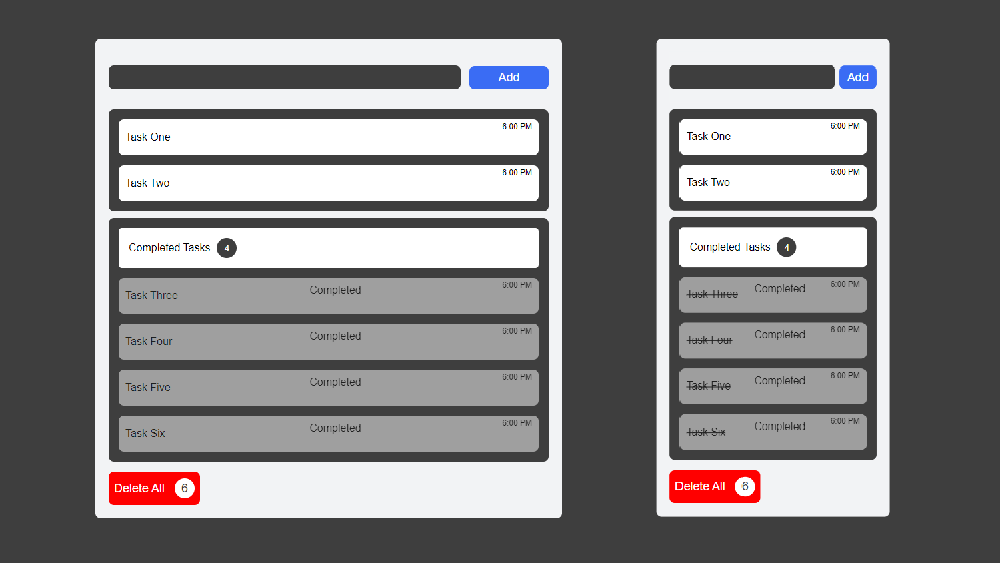
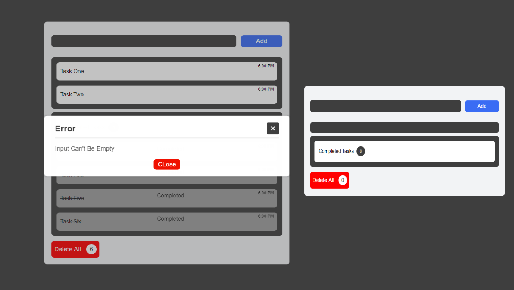

# To Do List


To Do List : You Can Add Your Tasks <br/>
Then You Can Mark As Completed Like <del>I have Been Completed</del><br/>
When You Add Task It Auto Saved in localStorage <br/>
You Also Can Delete One Task Or All Of Them

## Demo




## Prerequisites

Before you begin, ensure you have met the following requirements:

* [Git](https://git-scm.com/downloads "Download Git") must be installed on your operating system.

## Installing To Do List

To install **To Do List**, follow these steps:

Linux and macOS:

```bash
sudo git clone https://github.com/abdelrhman492/To-Do-List.git
```

Windows:

```bash
git clone https://github.com/abdelrhman492/To-Do-List.git
```

### Live Demo
* [To Do App](https://abdelrhman492.github.io/To-Do-List/ "Click Here")
